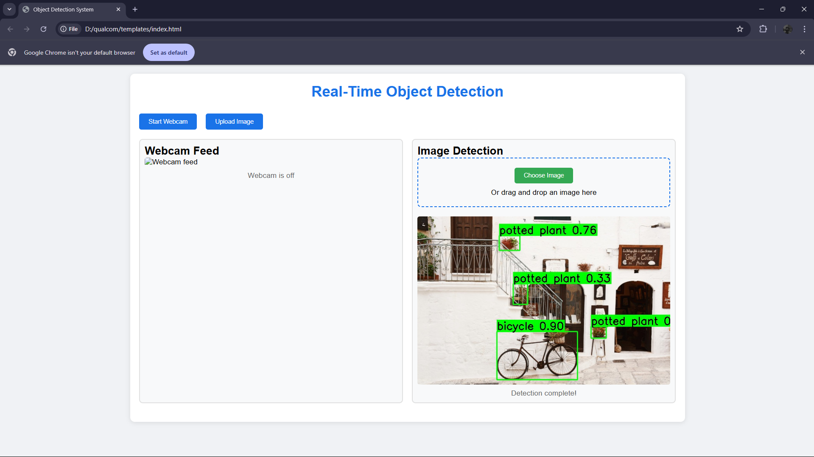
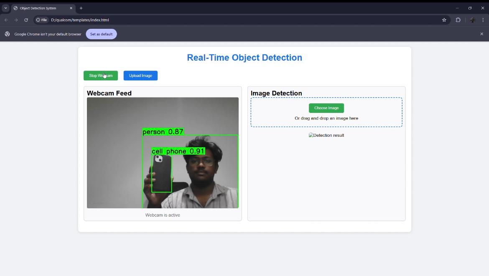

# DetectX---Object-Detection-Model


## Real-Time Object Detection System 🚀

A web-based application leveraging Flask and YOLOv5 to perform real-time object detection 
using webcam feeds or uploaded images. The app processes images, detects objects, and 
returns processed images with bounding boxes and confidence scores.

---

## 📜 Features
- **Webcam Feed Detection**: Real-time object detection via your webcam.
- **Image Upload**: Upload images for object detection.
- **Interactive UI**: User-friendly and visually appealing interface.
- **Device Support**: Utilizes GPU if available for faster detection.

---

## 🛠️ Installation Guide

Follow these steps to get the application up and running:

### 1. Clone the Repository
```bash
git clone https://github.com/your-username/your-repo-name.git
cd your-repo-name
```

### 2. Set Up a Virtual Environment
```bash
python -m venv venv
source venv/bin/activate  # For Linux/MacOS
venv\Scripts\activate     # For Windows
```

### 3. Install Dependencies
```bash
pip install -r requirements.txt
```

### 4. Run the Application
```bash
python app.py
```

### 5. Access the Web Application
Open your browser and navigate to:
```
http://127.0.0.1:5000/
```

---

## 📂 File Structure

```
├── app.py                 # Main application logic (Flask backend)
├── templates/
│   └── index.html         # Frontend interface
├── static/
│   ├── uploads/           # Directory for processed images
├── screenshots/
│   ├── image.png          # Example screenshot of the image detection result
│   └── video.jpeg         # Example screenshot of the webcam feed detection
├── requirements.txt       # List of required Python packages
└── README.md              # Project documentation
```

---

## 🖼️ Screenshots

### 1. Image Detection


### 2. Webcam Feed Detection


---

## 🔧 Requirements
- Python 3.8 or higher
- Torch with GPU support (optional for faster processing)
- OpenCV for image handling

---

## 🤝 Contributing
1. Fork the repository
2. Create a feature branch (`git checkout -b feature-name`)
3. Commit changes (`git commit -m "Add feature"`)
4. Push to the branch (`git push origin feature-name`)
5. Open a Pull Request

---

## 🛡️ License
This project is licensed under the MIT License - see the [LICENSE](LICENSE) file for details.

---

## 🌟 Acknowledgements
- [Ultralytics YOLOv5](https://github.com/ultralytics/yolov5) for the pre-trained object detection model.
- The amazing open-source community ❤️.

